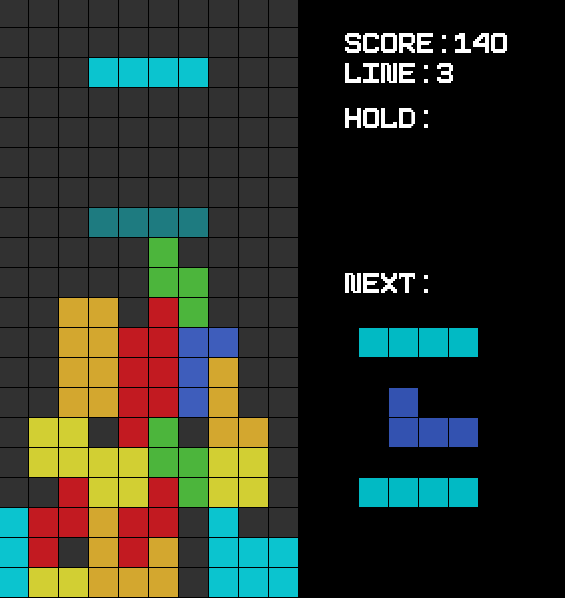

# Setup and installation

## Requirement 

For the project we used the SFML library to take care of the graphics and the network part of the project.  
So before doing anything you need to install SFML on your PC.  
To do so you can click on the link here :
[Download SFML](https://www.sfml-dev.org/download/sfml/2.5.1/)
You'll also need to have a way to compile C++ file (g++, Mingw, clang etc ....) and a way to run a Makefile 

## Launching the game

To launch the game you can juste launch the Makefile.  
You can launch the following command :   
**Soloplayer mode**  : `make run` to launch the game  
**Multiplayer mode** :
>You'll have to give more arguments to play the game in twoplayer mode.  
Template : `make run {server|client} {if client: Server IP adress}`  
When you play with two player you need one of the two to host the game. In this case he'll need to run the command   
`make run server` 
Then the other player (the client) needs to launch the following commmand.  
`make run client IP_adress` where the `IP_adress` is the IP adress of the server (the host)  
To check your IP adress on linux you can use `ip -4 a` 

# TETRIS GAME 

## Control keys

|Key|Output|Key|Output |
|-|-|-|-|
|&#8592; or `Q`| Move left |`Z`| Rotate CCW |
|&#8594; or `D`| Move right |`Space` | Hard drop |
|&#8595; or `S`| Move down |`Escape`| Quit the game |
|&#8595; or `X`| Rotate clockwise | `C` | Hold |

`CCW` : stands for Counterclockwise  
`Hold` : It will switch the current tetromino with the one in the hold space  
`Hard drop`: The tetromino will drop down instantly

## Multiplayer 

When you're playing two player mode, we added the "garbage".   
When a player clears n lines it will send n-1 lines to the opponent.

## What you should have 

